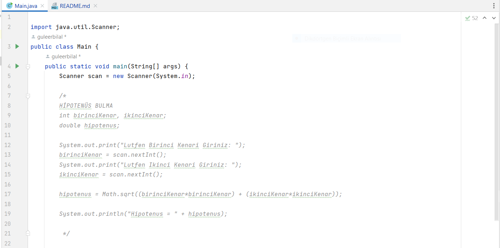
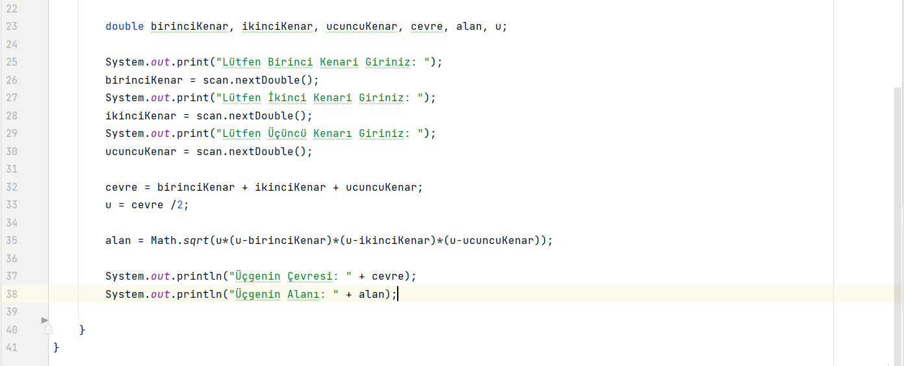
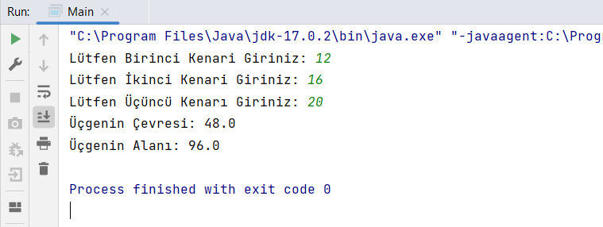

# MERHABA ÜÇGENİN ALANINI HESAPLAYAN PROGRAMIMA HOŞ GELDİNİZ

*[**Patika.Dev Profil Linkim**](https://app.patika.dev/guleerbilal)

* Bu ödevde girilen sayılara göre oluşan üçgenin alanını hesaplayan bir program yaptım.
* Üçgen alanı hesaplayan programımın üstünde de dik üçgenlerde olan hipotenüs bulma programım da bulunmaktadır.

## Kodlarım

*

*

*